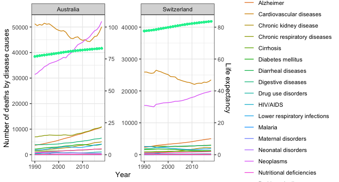

```{r,setup, include=FALSE}
options(htmltools.dir.version = FALSE)
```

```{r , echo = FALSE, message = FALSE, warning = FALSE}
library(tidyverse)
library(ggplot2)
library(readr)
library(knitr)
library(plotly)
library(gganimate)
library(gifski)
library(DT)
library(broom)
```

```{r,  echo = FALSE, message = FALSE, warning = FALSE}
annual_number_of_deaths_by_cause <- read_csv("Data/annual-number-of-deaths-by-cause.csv", 
    col_types = cols(`Number of executions` = col_double()))
life_expectancy <- read_csv("Data/life-expectancy.csv")
GDP <- read_csv("Data/GDP.csv")
```

```{r , echo = FALSE, message = FALSE, warning = FALSE}
world_data <-annual_number_of_deaths_by_cause %>% 
  filter(!is.na(Code),
         Year %in% c(1990:2018)) %>%
  pivot_longer(cols =  -c(1:3), 
               names_to = "Death_cause", 
               values_to = "Count") %>% 
  group_by(Year,Death_cause) %>% 
  summarise(Death_amount=sum(Count, na.rm = TRUE))

p1 <- ggplot(world_data,
       mapping = aes(x=Year,
                     y=Death_amount,
                     color=Death_cause))+
  geom_line()+
  theme_bw()

disease_data <- annual_number_of_deaths_by_cause %>% 
  select(1,3,5,6,7,8,9,12,13,14,15,16,17,18,22,24,26,27,32,33,34,36) %>% 
  filter(Country %in% c("Australia","Switzerland"),
         Year %in% c(1990:2018)) %>% 
  pivot_longer(cols =  -c(1:3), 
               names_to = "Death_cause", 
               values_to = "Count")

AZ_life_expectancy <- life_expectancy %>% filter(
  Entity %in% c("Australia","Switzerland"),
  Year %in% c(1990:2018)
) %>% 
  rename("Country" = "Entity",
         "Life_expectancy" = "Life expectancy") %>% 
  select(-Code)

DL_data <- disease_data %>% 
  left_join(AZ_life_expectancy,by=c("Country","Year"))

p2 <-ggplot(DL_data,
       mapping = aes(x=Year,
                     y=Count,
                     color=Death_cause))+
  geom_line()+
    facet_wrap(~Country,
             scales = "free_y")+
  theme_bw()

p3 <-ggplot(DL_data,
       mapping = aes(x=Year,
                     y=Count,
                     color=Death_cause))+
  geom_line()+
  geom_line(aes(y=Life_expectancy*500),
            color="#1CDC4B",
            size=1)+
  geom_point(aes(y=Life_expectancy*500),
             color="#12F09E",
             size=1)+
    scale_y_continuous(name = "Number of deaths by disease causes",
    sec.axis = sec_axis(trans =~./500,
                        name = "Life expectancy"))+
    facet_wrap(~Country,
             scales = "free_y")+
  theme_bw()

other_data <- annual_number_of_deaths_by_cause %>% 
  select(1,3,4,10,11,19,20,21,23,25,28,29,30,31,35) %>% 
  filter(Country %in% c("Australia","Switzerland"),
         Year %in% c(1990:2018)) %>% 
  pivot_longer(cols =  -c(1:3), 
               names_to = "Death_cause", 
               values_to = "Count")


p4 <- ggplot(other_data,
       mapping = aes(x=Year,
                     y=Count,
                     color=Death_cause))+
  geom_line()+
  facet_wrap(~Country,
             scales = "free_y")+
  theme_bw()


```

```{r,eval = TRUE, echo = FALSE, warning = FALSE, message = FALSE}
world_data_arrange <- world_data %>% 
  group_by(Year) %>% 
  arrange(Year, desc(Death_amount)) %>% 
  mutate(ranking = row_number()) 
```
background:DBE6B4
background-size: cover
--
## Death Causes since 1990
--
```{r,eval = TRUE, echo = FALSE, warning = FALSE, message = FALSE, fig.align="center",out.width = '80%'}
ggplot(world_data_arrange,
       aes(x = ranking,
           y = Death_amount)) +
  geom_col(aes(fill = Death_cause)) +
  geom_text(aes(label = Death_amount), hjust = -0.1) +
  geom_text(aes(y = 0, label = Death_cause), hjust = 1.1) +
  coord_flip(clip = "off") +
  scale_x_reverse() +
  theme_void() +
  theme(
    axis.ticks = element_blank(),
    axis.text = element_blank(),
    legend.position = 'none',
    plot.margin = margin(1, 4, 1, 3, "cm")) +
  labs(title = 'Year: {closest_state}', y = "Number of deaths by cause", x="") +
  transition_states(Year) +
  enter_fade() +
  exit_fade() +
  ease_aes('quadratic-in-out') 
```

---
## Number of Deaths by Causes, World, 1990 to 2019.
--
```{r,echo = FALSE, warning = FALSE, message = FALSE, fig.align="center",out.width = '120%' }
ggplotly(p1)
```
---
class: inverse 
## Interested Country: Australia and Switzerland
<br>
<br>
--
**Q1: What can be observed in the chart of causes of death due to disease?**
<br>
<br>
--
**Q2: What can be observed in the chart of causes of death due to others?**
---
## Number of deaths by disease causes in Australia and Switzerland.
--
```{r, echo = FALSE, warning = FALSE, message = FALSE, fig.align="center",out.width = '120%' }
ggplotly(p2)
```
---
## Life Expectancy in Australia and Switzerland 
```{r,echo = FALSE, warning = FALSE, message = FALSE, fig.align="center",out.width = '80%', }
life_table <- life_expectancy %>% 
  filter(
  Year %in% (1990:2018),
  Entity %in% c("Australia","Switzerland")
)
datatable(life_table)
```
---
## Add a line of life expectancy

```{r, echo = FALSE, warning = FALSE, message = FALSE, fig.align="center",fig.width=6.8,fig.height=3.7 }

```

---
## Number of deaths by other causes in Australia and Switzerland.
--

```{r, echo = FALSE, warning = FALSE, message = FALSE, fig.align="center",out.width = '120%' }
ggplotly(p4)
```

---
## 2009Black Saturday bushfires

The Black Saturday bushfires were a series of bushfires that either ignited or were already burning across the Australian state of Victoria on and around Saturday, 7 February 2009, and were among Australia's all-time worst bushfire disasters. 
```{r,echo = FALSE, warning = FALSE, message = FALSE, fig.align="center",out.width = '100%'}
knitr::include_graphics("figs/fire.jpg")
```

---
```{r , echo = FALSE, message = FALSE, warning = FALSE}
df_global <-  annual_number_of_deaths_by_cause %>%
  filter(Year %in% c(1950:2018)) %>% 
  pivot_longer(
    cols =  -c(Country, Code, Year),
    names_to = "Death_cause",
    values_to = "Count"
  )

df_CI <- df_global %>%  
  filter(Country %in% c("China", "India"))

interest <- c(
  "Cardiovascular diseases",
  "Diabetes mellitus",
  "HIV/AIDS",
  "Neoplasms",
  "Nutritional deficiencies",
  "Malaria"
)
```

```{r , echo = FALSE, message = FALSE, warning = FALSE}
CI_Percent <- df_CI%>% 
  group_by(Country,
           Year) %>% 
  mutate(Total_death = sum(Count, na.rm = TRUE)*100
         ) %>% 
  group_by(Country,
           Year,
           Death_cause,
           Total_death) %>% 
  summarize(Percentage = Count/Total_death*100) %>% 
  group_by(Country,
           Death_cause) %>% 
  arrange(desc(Percentage)) %>% 
  filter(Death_cause %in% interest)

CI_Total <- df_CI %>%
  group_by(Country,
           Year,
           Death_cause) %>%
  mutate(Death_abs = sum(Count, na.rm = TRUE)) %>%
  filter(Death_cause %in% interest) %>%
  group_by(Year,
           Country,
           Death_cause,
           Death_abs) %>%
  summarise() %>%
  left_join(GDP, by = c ("Country" = "Entity", 
                         "Year" = "Year"))
```

```{r Percentage Change in China and India, echo = FALSE, message = FALSE, warning = FALSE}
Percentage_trend <- CI_Percent %>% 
  ggplot(aes(x = Year,
             y = Percentage,
             color = Death_cause))+
  geom_line() +
  theme_bw()+
  facet_wrap(~Country, nrow = 2, scales = "free_y")

Absolute_trend <- CI_Total %>% 
  ggplot(aes(x = Year))+
  geom_line(aes(y = Death_abs,
             color = Death_cause)) +
  geom_line(aes(y = gdppc*500)) +
  facet_wrap(~Country, nrow = 2, scales = "free_y") +
  theme_bw()
```

class: inverse 
## Interested Country: China and India
<br>
<br>
--
**Q1: What are the diseases that growing fastest in developing country?**
<br>
<br>
--
**Q2: How the diseases changes with the change of GDP per capita**
--

### 6 most typical diseases we focusing on 

#### Cardiovascular diseases

#### Diabetes mellitus
  
#### HIV/AIDS
  
#### Neoplasms
  
#### Nutritional deficiencies
  
#### Malari

---
## Percentage of the 6 Death causes in China and India
--

```{r percentage trend, echo = FALSE, message = FALSE, warning = FALSE, fig.align="center", out.width = '100%'}
ggplotly(Percentage_trend)
```

---

## Number of people that dead from the 6 deseases
--
```{r absolute trend, echo = FALSE, warning = FALSE, message = FALSE, fig.align="center", out.width = '100%'}
ggplotly(Absolute_trend)
```

---

## Number of death caused by "Cardiovascular diseases" and "Neoplasms" against GDP per capita
```{r Run regression with the number of deasease against GDP per capita, , echo = FALSE, warning = FALSE, message = FALSE}
CI_model <- CI_Total %>%
  filter(Death_cause %in% c("Cardiovascular diseases", "Neoplasms")) %>%
  group_by(Country,
           Death_cause) %>%
  nest() %>%
  mutate(model = map(
    .x = data,
    .f = function(x) {
      lm(Death_abs ~ gdppc,
         data = x)
    }
  ))

CI_coef <- CI_model %>%
  mutate (tidy = map(model, tidy)) %>%
  unnest(tidy) %>%
  select(Country, Death_cause, term, estimate) %>%
  pivot_wider(
    id_cols = c("Country", "Death_cause"),
    names_from = term,
    values_from = estimate
  ) %>%
  rename("Intercept" = "(Intercept)",
         "Slope" = "gdppc")

CI_model_fitness <- CI_model %>%
  mutate(glance = map(model, glance)) %>%
  unnest(glance) %>%
  select(Country, Death_cause, r.squared) %>%
  mutate(r.squared = round(r.squared, 2)) %>% 
  right_join(CI_coef) %>% 
  mutate(Intercept = round(Intercept, 2),
         Slope = round(Slope, 2))

datatable(CI_model_fitness)
```

#### For every 1 unit of gdppc increase, the number of death caused by the deceased will increase by the number of the slope.

#### R^2 means the percentage of variability observed in the target variable is explained by the regression model.


```{r,echo = FALSE, message = FALSE, warning = FALSE}
Mexico <- annual_number_of_deaths_by_cause %>%
  filter(Country == "Mexico") %>%
  filter(!is.na(Code), Year >= 2005) %>%
  pivot_longer(cols = c(4:36), 
               names_to = "Death_cause", 
               values_to = "Count") %>% 
  group_by(Death_cause) %>% 
  summarise(Death_amount=sum(Count, na.rm = TRUE))%>%
  arrange(desc(Death_amount))

Germany <- annual_number_of_deaths_by_cause %>%
  filter(Country == "Germany") %>%
  filter(!is.na(Code), Year >= 2005) %>%
  pivot_longer(cols = c(4:36), 
               names_to = "Death_cause", 
               values_to = "Count") %>% 
  group_by(Death_cause) %>% 
  summarise(Death_amount=sum(Count, na.rm = TRUE))%>%
  arrange(desc(Death_amount))


Mexico_cause <- annual_number_of_deaths_by_cause %>% 
    select(-2, -4) %>% 
  filter(Country == "Mexico",
         Year >= 2005) %>% 
  pivot_longer(cols =  -c(1:2), 
               names_to = "Death_cause", 
               values_to = "Count") 
Mexico_plot <- Mexico_cause %>%
  filter(Death_cause %in% c("Cardiovascular diseases", 
                            "Neoplasms",
                            "Chronic kidney disease",
                            "Digestive diseases",
                            "Diabetes mellitus")) %>%
  ggplot(mapping = aes(x = Year)) +
  geom_line(aes(y = Count,
  color = Death_cause)) +
  ggtitle("Mexico death cause trend")+
  theme_bw()

Germany_cause <- annual_number_of_deaths_by_cause %>% 
    select(-2, -4) %>% 
  filter(Country == "Germany",
         Year >= 2005) %>% 
  pivot_longer(cols =  -c(1:2), 
               names_to = "Death_cause", 
               values_to = "Count") 
Germany_plot <- Germany_cause %>%
  filter(Death_cause %in% c("Cardiovascular diseases", 
                            "Neoplasms",
                            "Digestive diseases",
                            "Alzheimer's disease and other dementias",
                            "Chronic respiratory diseases")) %>%
  ggplot(mapping = aes(x = Year)) +
  geom_line(aes(y = Count,
  color = Death_cause)) +
  ggtitle("Germany death cause trend")+
  theme_bw()
```

---
class: inverse 
## Interested Country: Mexico and Germany
<br>
<br>
--

**Q1: In Mexico and Germany, what are the top five diseases that cause the most deaths from 2005?**
<br>
<br>
--
**Q2: What are the trends of these countries over the 15 years？**

---
## Table of top 5 cauese of death in Mexico since 2005
--
```{r echo = FALSE, warning = FALSE, message = FALSE}
Mexico %>% 
  arrange(desc(Death_amount)) %>% 
  head(5) %>% 
  kable( )
```

---
## Table of top 5 cauese of death in Germany since 2005
--
```{r, echo = FALSE, warning = FALSE, message = FALSE}
Germany %>% 
  arrange(desc(Death_amount)) %>% 
  head(5) %>% 
  kable( )
```

---
## Grpah of the tend of these disease since 2005
```{r echo = FALSE, warning = FALSE, message = FALSE, fig.align="center",out.width = '100%', }
ggplotly(Mexico_plot)
```

---
## Grpah of the tend of these disease since 2005
```{r echo = FALSE, warning = FALSE, message = FALSE, fig.align="center",out.width = '110%', }
ggplotly(Germany_plot)
```


```{r echo = FALSE, warning = FALSE, message = FALSE}
disease_data_Benin <- annual_number_of_deaths_by_cause %>% 
  select(1,3,5,6,7,8,9,10,11,12,13,14,15,16,17,18,19,20,21,22,23,24,25,26,27,28,29,30,31,32,33,34,35,36) %>% 
  filter(Country %in% c("Benin"),
         (Year >= 2000)) %>% 
  pivot_longer(cols =  -c(1:2), 
               names_to = "Death_cause", 
               values_to = "Count")%>%
  group_by(Death_cause) %>% 
  summarise(Death_amount=sum(Count, na.rm = TRUE))%>%
arrange(desc(Death_amount))%>%
  head(n=5)

disease_data_Mozambique <- annual_number_of_deaths_by_cause %>% 
  select(1,3,5,6,7,8,9,10,11,12,13,14,15,16,17,18,19,20,21,22,23,24,25,26,27,28,29,30,31,32,33,34,35,36) %>% 
  filter(Country %in% c("Mozambique"),
         (Year >= 2000)) %>% 
  pivot_longer(cols =  -c(1:2), 
               names_to = "Death_cause", 
               values_to = "Count")%>%
  group_by(Death_cause) %>% 
  summarise(Death_amount=sum(Count, na.rm = TRUE))%>%
arrange(desc(Death_amount))%>%
  head(disease_data_Mozambique,n=5)

disease_data_Benin_plot <- annual_number_of_deaths_by_cause %>% 
  select(1,3,9,13,16,17,18,22) %>% 
  filter(Country %in% c("Benin"),
         (Year >= 2000)) %>% 
  pivot_longer(cols =  -c(1:2), 
               names_to = "Death_cause", 
               values_to = "Count")

disease_data_Mozambique_plot <- annual_number_of_deaths_by_cause %>% 
  select(1,3,9,13,15,16,18) %>% 
  filter(Country %in% c("Mozambique"),
         (Year >= 2000)) %>% 
  pivot_longer(cols =  -c(1:2), 
               names_to = "Death_cause", 
               values_to = "Count")

Q1 <- ggplot(disease_data_Benin_plot, aes(x=Year, 
 y= Count,
 color=Death_cause))+geom_line(size=1)+ggtitle("Trends of top five death rate in Benin")

Q2 <- ggplot(disease_data_Mozambique_plot, aes(x=Year, 
 y= Count,
 color=Death_cause))+geom_line(size=1)+ggtitle("Trends of top five death rate in Mozambique")
 
```

---
class: inverse 
## Interested Country: Benin and Mozambique

<br>
<br>
--

**Q1: What are top 5 reasons to cause death in Benin and Mozambique, and what may be the reason for it? **
<br>
<br>
--
**Q2: What is the development trend of these reasons in the above question?**

---
## Table of top 5 cauese of death in Benin since 2000
--
```{r echo = FALSE, warning = FALSE, message = FALSE}
disease_data_Benin %>% kable
```
---
## Table of top 5 cauese of death in Mozambique since 2000
--
```{r echo = FALSE, warning = FALSE, message = FALSE, fig.align="center",out.width = '120%'}
disease_data_Mozambique %>% kable
```
---
## Grpah of the tend of these disease since 2000
```{r echo = FALSE, warning = FALSE, message = FALSE}
gridExtra::grid.arrange(Q1,Q2, nrow = 2)
```

---
class: inverse 
## Conclusion


